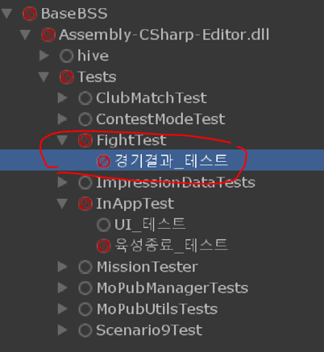
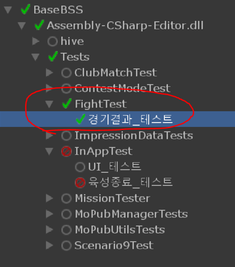

## 1. TDD(Test Driven Development) 개요
TDD(테스트 주도 개발)는 기존의 전통적인 폭포수 모델(Waterfall Model)을 따르지 않는, 애자일 개발 방법론 중 하나인 **상향식 개발** 방식.

기존 개발 방식이 구조나 설계를 먼저 고민했다면, TDD는 **기능에 대한 검증을 먼저 생각**하며 개발자가 품질 관리에 대한 책임을 직접 질 수 있도록 돕는다.

* **테스트의 소유:** 테스트 코드를 먼저 구현하므로 테스트를 소유하게 되며, 일회성이 아니기 때문에 지속적인 **자동화**가 가능.
* **두려움을 지루함으로:** 일반적으로 코드가 늘어날수록 '이걸 고치면서 다른 부분이 망가지지 않았을까?' 하는 두려움이 생긴다. TDD는 끊임없이 테스트를 돌리는 과정을 통해 이 두려움을 차라리 '지루함'으로 전환하며 변화에 강하고 자신감 있는 코드를 만들어준다.
* **실용적인 상향식 구조:** 실제 사용하는 결과값이나 목적을 중심으로 구현하므로 기능을 우선시하는 실용적인 개발이 가능하며, 구조는 실제 구현체에 맞춰 유연하게 리팩토링된다.

---

## 2. TDD에서 가져야 할 마인드셋 & 규칙
TDD를 성공적으로 안착시키기 위해서는 객체의 설계 이전에 **결과에서 출발하는 사고방식**이 중요하다.

1. **결과 중심적 사고:** 어떤 객체를 만들어야 하는지보다, 어떤 테스트를 만들고 어떤 `Assert`문(결과 검증)을 구성할지 먼저 생각해야한다.
2. **할 일 목록 작성:** 작성할 테스트 목록을 미리 많이 적어두고, 테스트 단위가 너무 크다고 느껴질 때는 잘게 쪼개는 것이 원칙.
3. **지속적인 추가:** 테스트를 진행하면서 생기는 새로운 테스트 요구사항들을 작업 목록에 계속 적어두며 의미 있는 테스트를 축적한다.

---

## 3. 핵심 개발 주기: [빨강 – 초록 – 리팩토링] 패턴
TDD는 생성-실패-성공-개선의 유기적인 3단계 사이클을 반복하며 코드를 발전시킨다.

* **🔴 빨강 (Red):** 실패하는 작은 테스트를 작성한다. 이때, 구현체가 없기 때문에 이 단계에서는 처음엔 컴파일조차 되지 않는 것이 정상.
* **🟢 초록 (Green):** 실패한 테스트가 어떻게든 통과할 수 있도록 코드를 수정한다. 이 단계에서는 테스트 통과만을 목적으로 하기 때문에, 내부를 하드코딩하는 등 어떠한 죄악을 저질러도 괜찮다.
* **🔵 리팩토링 (Refactor):** 초록 막대 과정에서 생겨난 중복을 제거하고 코드의 양을 줄이거나 구조화해 나간다.

---

## 4. 실전 예제: 경기 결과 및 보상 시스템 구현
*요구사항 예시: 경기 결과에 따른 골드 보상 계산 기능 개발*

### 단계 1: 빨강 막대 단계 (컴파일 에러 및 슈도 코드)
가장 먼저 인터페이스나 클래스가 없더라도 최종 검증하고자 하는 구조의 테스트 코드를 먼저 작성한다. 당연히 이 상태에서는 컴파일 에러가 발생하거나 테스트가 실패한다.

```csharp
[Test]
public void 경기결과_테스트()
{
    // todo : 보상 정보 받음
    Reward reward = new Reward();
    reward.ClearReward = 2000;
    reward.HpReward = 30;
    reward.TimeReward = 4000;
    reward.OverTimeLost = -200;
    reward.MininumTimeToGetTheTimeReward = 30;

    // todo : 경기 결과 생성
    Result result = new Result();
    result.Win = 1;
    result.ElapsedTime = 45;
    result.RemainingHP = 50;

    // todo : 경기 결과를 전달
    IRewardProcesser processer = new TestRewardProcesser(reward, result);
    processer.GetRewardFromResult((int reward) => 
    {
        // todo : 경기 보상을 받음
        Assert.AreEqual(2000 + 50 * 30 + 4000, reward);
    });
}
```



### 단계 2: 초록 막대 단계 (가짜 구현 및 하드코딩)
컴파일 에러를 해결하기 위해 필요한 클래스와 메서드를 껍데기만 생성한 뒤, 테스트를 무조건 통과시키기 위해 내부 값을 하드코딩하여 Invoke 한다. 유니티 Test Runner에서 **초록색 체크 마크**를 띄우는 것이 최우선 목적.

```csharp
// 테스트 성공만을 위해 임시로 가짜 값(1000 등)을 강제로 반환하여 초록 막대를 확인
public void GetRewardFromResult(RewardCallback callback)
{
    callback.Invoke(false, 1000); 
}
```



### 단계 3: 리팩토링 단계 (진짜 알고리즘 반영 및 테스트 최적화)
초록 막대를 확인했다면 안심하고 하드코딩을 지운 뒤, 중복을 제거하고 실제 알고리즘을 구현.

```csharp
public void GetRewardFromResult(RewardCallback callback)
{
    int gold = 0;

    if (result.Win == 0)
    {
        callback.Invoke(false, 0);
        return;
    }

    gold += reward.ClearReward;
    gold += reward.HpReward * Mathf.Max(0, result.RemainingHP);

    int lostTimeInBaseTime = Mathf.Max(0, result.ElapsedTime - reward.MininumTimeToGetTheTimeReward);
    gold += reward.TimeReward + reward.OverTimeLost * lostTimeInBaseTime;

    callback.Invoke(true, gold);
}
```

테스트가 무너지지 않는 것을 확인하면서, 유지보수를 위해 테스트 코드 자체도 가독성 있게 한 단계 더 리팩토링해준다.

```csharp
[Test]
public void 경기결과_테스트()
{
    시작정보 = new StartInfo();
    시작정보.Reward = 승리보상2000_체력보상30_시간보상4000_시간손실200_감소기준30();
    시작정보.RewardProcesser = 테스트_결과처리기(시작정보.Reward);

    경기결과 = 경기승리_경과시간45_남은체력50();
    
    보상을_확인해보자(경기결과, 4500); // 최종 목적인 테스트가 가능한 깔끔한 코드 [cite: 67, 68]
}
```

---

## 5. 유니티 Test Runner 활용하기
유니티 엔진은 강력한 자체 테스트 자동화 기능인 **Test Runner**를 내장하고 있어 TDD 환경을 완벽히 보장한다.

* **데이터 및 플레이 테스트 지원:** 단순 코드 검증용 EditMode 테스트뿐만 아니라, 씬을 직접 구동하는 PlayMode 테스트를 모두 제공.
* **다양한 Assert API:** 유니티 환경에 특화된 수많은 Assert 메서드가 존재하여 모든 값 비교 구문을 만들 수 있다.
* **범위형 파라미터 기능:** 속성을 파라미터에 지정하면 리스트 내의 모든 값을 자동으로 순회하여 대량의 케이스를 테스트해 준다.
* **CLI 빌드 자동화:** Command Line Interface 기능을 제공하므로 CI/CD 파이프라인에 엮어 테스트 자동화 시스템을 구축할 수 있다.

---

## 6. TDD 도입 후 느낀 점 요약
* **독립적인 개발 가능:** 다른 파트의 리소스나 작업이 안 되어 있어도 가짜 구현을 통해 내 로직부터 먼저 독립적으로 TDD 개발이 가능하다.
* **자연스러운 컴포넌트화:** 테스트 환경 구성을 고민하다 보면 객체 간 의존성이 낮아져 컴포넌트화가 자연스럽게 이루어진다.
* **심리적 안정감과 자신감:** 초록 막대에 다다른 순간 심리적으로 매우 편해지며, 시간이 지날수록 코드가 낡아 손댈 수 없게 되는 대신 촘촘한 테스트들 덕분에 리팩토링이나 수정 시 코드에 대한 확신과 자신감이 생긴다.